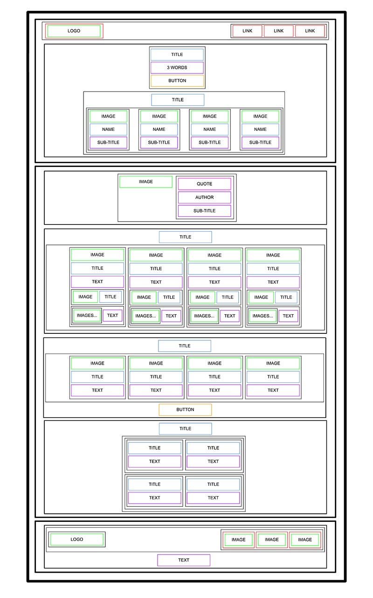

# 
HTML Advanced

<!-- 

 -->

- [Learning Objectives](#Learning_Objectives)
- [Requirements](#Requirements)
- [Mandatory Tasks](#Mandatory_Tasks)

## Learning Objectives
 

* What is HTML
* How to create an HTML page from a wireframe
* What is a markup language
* What is the DOM
* What is an element / tag
* What is an attribute
* What the purpose of each HTML tag

## Requirements

* All your files should end with a new line
* A mandatory `README.md` file with meaningful information about the content, should be placed at the root folder of the project.
* You are not allowed to install, import or use external libraries. This website must be build with only HTML/CSS/JavaScript. No NodeJS, React, VueJS, Bootstrap, etc.
* Your code should be W3C compliant and validate with W3C-Validator

## Tasks

### Task 0. README and objectives!

In this and coming projects, you will implement from scratch a webpage from a designer file.

For this first project, you will focus on the HTML structure only - no CSS, no style - just pure HTML semantic.

This designer file will be available on Figma - feel free to create an account to access the final result here:

* Page in Figma
* fig file

Important notes with Figma:

* if your computer doesn’t have missing fonts, you can find them here: `source-sans-pro` and `Spin-Cycle-OT`
* some values are in float - feel free to round them

For this task, please write an amazing `README.md`

And “Duplicate to your Drafts” to have access to all design details.

### Task 1. Header

Let’s start at the top: the `header`:

Here is the wireframe of it:

* Create the HTML skeleton (html, head, body, etc.)
* In the body, add a header tag
* Inside this header:
	* Add a link element with an image inside
	* Add a block of 3 link elements

### Task 2. Banner

Now, the banner inside the `header`:

Inside the `header`, add a `section` element inside.

In this `section` element, add:

* A block containing:
	* A heading tag (level 1, don’t forget to use the correct heading value)
	* A text element
	* A button tag
* Another block containing:
	* Another heading tag (level 2, be careful about which one you are using)
	* A block containing 4 blocks - each block containing:
		* An image
		* A heading tag (level 3)
		* A text

Under the `header` add a `main` element

### Task 3. Quote

Under the banner, we will add the quote block:

The quote section is inside the main:

* Create a new section for the quote
* Inside, add a block containing:
	* An image
	* Another block with inside:
      	* A blockquote tag
		* A text tag for the quote author
		* Another text

### Task 4. Videos

Let’s now add the videos list:

New section containing:

* A heading tag (level 1)
* A block containing the 4 video blocks - each of them are composed with:
	* An image
	* A heading (level 2)
	* A text
	* Add a block for the author information:
		* An image
		* A heading (level 3)
	* A block for the rating:
		* A block of images (one star = one image)
		* A text

### Task 5. Membership

The Membership section is similar to the videos list:

After the videos list section, add a new section containing:

* A heading (level 1)
* A block containing 4 block items - each block containing:
	* An image
	* A heading (level 2)
	* A text
* A button

### Task 6. FAQ

The FAQ section is ending the page before the footer:

Add a section for the FAQ containing:

* A heading (level 1)
* A block that contains 2 “row blocks”
* Each “row block” contains 2 “item blocks”
* Each “item block” is composed of:
	* A heading (level 2)
	* A text

Hint: There is no “row block” tag, “row” is referring to the styling that will be applied in a future project. It just means two “rows” containing two “items” each, also containing their own elements.

### Task 7. Footer

And… the footer!

After the last section, outside of the main, add a footer:

* A block (used later for centering the footer content), inside this block:
	* Another block with:
		* An image
		* Another block containing:
			* 3 Images with link
	* A text

And… that’s it for the moment - the result should not be shiny, don’t worry, CSS is coming…
